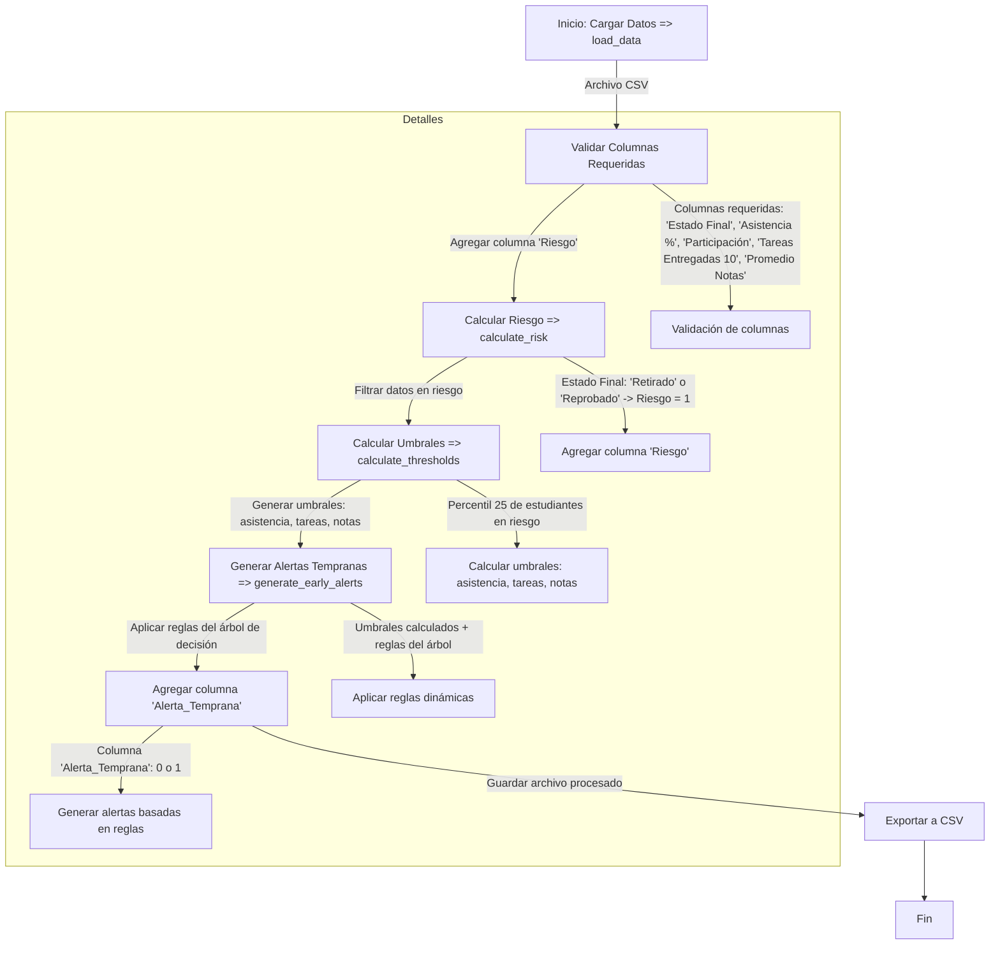

### Diagrama en formato **Mermaid** que describe el flujo completo del proceso, mostrando cuándo y dónde se agregan las nuevas columnas y cómo se utilizan:

---

### **Explicación del diagrama**

1. **Inicio: Cargar Datos (`load_data`)**:
   - Se carga el archivo CSV y se validan las columnas requeridas:
     - `Estado Final`
     - `Asistencia (%)`
     - `Participación`
     - `Tareas Entregadas (10)`
     - `Promedio Notas`

2. **Calcular Riesgo (`calculate_risk`)**:
   - Se agrega la columna **`Riesgo`**:
     - `Riesgo = 1` si `Estado Final` es "Retirado" o "Reprobado".
     - `Riesgo = 0` en caso contrario.

3. **Calcular Umbrales (`calculate_thresholds`)**:
   - Se filtran los estudiantes en riesgo (`Riesgo = 1`).
   - Se calculan los umbrales basados en el percentil 25 de las columnas:
     - **`Asistencia (%)`**
     - **`Tareas Entregadas (10)`**
     - **`Promedio Notas`**

4. **Generar Alertas Tempranas (`generate_early_alerts`)**:
   - Se aplica la función `apply_decision_tree_rules` para generar alertas basadas en las reglas aprendidas por el árbol de decisión.
   - Se agrega la columna **`Alerta_Temprana`**:
     - `Alerta_Temprana = 1` si el estudiante cumple con las condiciones de riesgo.
     - `Alerta_Temprana = 0` en caso contrario.

5. **Exportar a CSV**:
   - Los datos procesados, incluyendo las columnas **`Riesgo`** y **`Alerta_Temprana`**, se guardan en un archivo CSV.

---

### **Nuevas columnas agregadas y su uso**

1. **Columna `Riesgo`**:
   - **Cuándo se agrega**: Durante la ejecución de `calculate_risk`.
   - **Cómo se utiliza**:
     - Para filtrar estudiantes en riesgo al calcular los umbrales.
     - No se utiliza directamente en la generación de alertas.

2. **Columna `Alerta_Temprana`**:
   - **Cuándo se agrega**: Durante la ejecución de `generate_early_alerts`.
   - **Cómo se utiliza**:
     - Indica si un estudiante está en riesgo según las reglas del árbol de decisión.
     - Se incluye en el archivo CSV exportado para que el docente pueda identificar a los estudiantes en riesgo.

---

### **Conclusión**

Este diagrama muestra claramente cómo se procesan los datos, cuándo se agregan las columnas `Riesgo` y `Alerta_Temprana`, y cómo estas se utilizan en el flujo del sistema.
---
