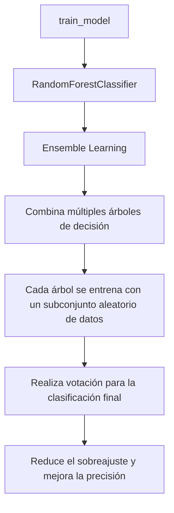

Diagrama en formato Mermaid que explica cómo funciona la función `train_model` basada en la técnica estadística utilizada por la librería `RandomForestClassifier` de `scikit-learn`:



### Explicación:
1. **RandomForestClassifier**: Es un modelo de aprendizaje de conjunto (ensemble learning) que combina múltiples árboles de decisión.
2. **Ensemble Learning**: Utiliza varios modelos (en este caso, árboles de decisión) para mejorar la precisión y reducir el riesgo de sobreajuste.
3. **Subconjuntos aleatorios**: Cada árbol se entrena con un subconjunto aleatorio de datos y características, lo que introduce diversidad en los modelos.
4. **Votación**: Para la clasificación, cada árbol "vota" por una clase, y la clase con más votos es la predicción final.
5. **Ventajas**: Este enfoque reduce el sobreajuste que puede ocurrir con un solo árbol de decisión y mejora la precisión general del modelo.

En este contexto, el modelo `RandomForestClassifier` trabaja con las siguientes variables, que se derivan del DataFrame `df` después de la preparación de características en la función `prepare_features`:

### Variables utilizadas por el modelo:
1. **`Asistencia (%)`**: Representa el porcentaje de asistencia de los estudiantes.
2. **`Promedio Notas`**: Promedio de las calificaciones obtenidas por los estudiantes.
3. **`Tareas Entregadas (10)`**: Número de tareas entregadas por los estudiantes (de un total de 10).
4. **`Participación_encoded`**: Una versión codificada de la columna `Participación`, que convierte valores categóricos en valores numéricos utilizando `LabelEncoder`.

Estas variables se combinan para formar la matriz de características `X`, que es utilizada por el modelo para entrenarse.

### Cómo trabaja el modelo:
1. **Lectura de datos**:
   - El modelo lee los datos fila por fila desde el archivo CSV (`datos_procesados.csv`).
   - Cada fila representa un estudiante con sus respectivas características.

2. **Preparación de características**:
   - La función `prepare_features` selecciona las columnas relevantes (`Asistencia (%)`, `Promedio Notas`, `Tareas Entregadas (10)`, y `Participación`) y transforma la columna `Participación` en valores numéricos (`Participación_encoded`).

3. **Entrenamiento del modelo**:
   - El modelo utiliza las características (`X`) y la variable objetivo (`y`, que es la columna `Riesgo`) para entrenarse.
   - Internamente, el modelo crea múltiples árboles de decisión. Cada árbol se entrena con un subconjunto aleatorio de filas y columnas de `X` (técnica conocida como **bootstrap sampling** y **feature bagging**).

   ***Definición de Riesgo, como objetivo***

    [Minería de Datos en este Proyecto](Minería_de_datos_en_el_proyecto.md)
   En el código fuente proporcionado, el objetivo (`y`) se determina explícitamente en esta línea dentro del bloque principal (`if __name__ == '__main__':`):

    ```python
    y = df['Riesgo']
    ```

    ### Explicación:
    1. **Selección de la columna objetivo**:
    - Aquí se está seleccionando la columna `Riesgo` del DataFrame `df` como la variable objetivo (`y`).
    - Esto significa que el modelo aprenderá a predecir los valores de la columna `Riesgo` basándose en las características (`X`).

    2. **¿Dónde se especifica que `Riesgo` es la columna objetivo?**:
    - Esto no está configurado automáticamente en el código. Es el programador quien decide que la columna `Riesgo` será la variable objetivo al escribir esta línea:
        ```python
        y = df['Riesgo']
        ```
    - Por lo tanto, el programador debe asegurarse de que la columna `Riesgo` exista en el archivo CSV (`datos_procesados.csv`) y contenga los valores que se desean predecir (por ejemplo, "Sí" o "No").

    3. **Relación con las características (`X`)**:
    - Las características (`X`) se preparan en la función `prepare_features`, que selecciona las columnas relevantes del DataFrame `df`:
        ```python
        features = df[['Asistencia (%)', 'Promedio Notas', 'Tareas Entregadas (10)', 'Participación_encoded']]
        ```
    - Estas características (`X`) se utilizan junto con la variable objetivo (`y`) para entrenar el modelo:
        ```python
        model.fit(X, y)
        ```

    4. **¿Qué pasa si `Riesgo` no está en el archivo CSV?**:
    - Si la columna `Riesgo` no existe en el archivo `datos_procesados.csv`, el programa lanzará un error en esta línea:
        ```python
        y = df['Riesgo']
        ```
    - Esto generará una excepción del tipo `KeyError`, ya que el DataFrame `df` no tendrá una columna con ese nombre.

    ### Resumen:
    - El objetivo (`y`) se define explícitamente en el código como la columna `Riesgo` del archivo CSV.
    - Es responsabilidad del programador asegurarse de que la columna `Riesgo` esté presente en el archivo de entrada y contenga los valores correctos para el entrenamiento del modelo.


4. **Predicción**:
   - Durante la predicción, cada árbol de decisión realiza una clasificación para una fila de entrada.
   - El modelo combina las predicciones de todos los árboles mediante votación para determinar la clase final (por ejemplo, "Riesgo" o "No Riesgo").

### Detalles adicionales:
- **Técnica estadística**: El modelo utiliza árboles de decisión como base, que dividen los datos en función de reglas basadas en las características. La combinación de múltiples árboles (bosque aleatorio) reduce el riesgo de sobreajuste y mejora la generalización.
- **Importancia de características**: El modelo también puede calcular la importancia de cada característica, lo que permite identificar cuáles son las más relevantes para predecir el riesgo.

---
## EJEMPLO

Ejemplo detallado de cómo trabaja el modelo `RandomForestClassifier` en tu contexto, con gráficos de texto y valores para ilustrar mejor el proceso:

---

### Ejemplo: Cómo trabaja el modelo

#### **1. Lectura de datos**
Supongamos que el archivo `datos_procesados.csv` contiene los siguientes datos:

| Asistencia (%) | Promedio Notas | Tareas Entregadas (10) | Participación | Riesgo |
|----------------|----------------|------------------------|---------------|--------|
| 85            | 7.5            | 8                      | Alta          | No     |
| 60            | 5.0            | 5                      | Media         | Sí     |
| 95            | 9.0            | 10                     | Alta          | No     |
| 50            | 4.0            | 3                      | Baja          | Sí     |

#### **2. Preparación de características**
La función `prepare_features` transforma los datos en una matriz de características (`X`) y una variable objetivo (`y`):

- **Codificación de `Participación`**:
  - `Alta` → 0
  - `Media` → 1
  - `Baja` → 2

- **Matriz de características (`X`)**:
  ```plaintext
  Asistencia (%) | Promedio Notas | Tareas Entregadas (10) | Participación_encoded
  -------------------------------------------------------------------------------
  85             | 7.5            | 8                      | 0
  60             | 5.0            | 5                      | 1
  95             | 9.0            | 10                     | 0
  50             | 4.0            | 3                      | 2
  ```

- **Variable objetivo (`y`)**:
  ```plaintext
  Riesgo
  ------
  No
  Sí
  No
  Sí
  ```

#### **3. Entrenamiento del modelo**
El modelo `RandomForestClassifier` crea múltiples árboles de decisión. Cada árbol se entrena con un subconjunto aleatorio de filas y columnas de `X` (técnica de **bootstrap sampling** y **feature bagging**).

##### Ejemplo de un árbol de decisión:
Un árbol de decisión podría dividir los datos así:

```plaintext
¿Asistencia (%) > 70?
├── Sí: ¿Promedio Notas > 6.5?
│   ├── Sí: Clase = No Riesgo
│   └── No: Clase = Sí Riesgo
└── No: Clase = Sí Riesgo
```

Cada árbol tiene reglas diferentes debido al muestreo aleatorio.

#### **4. Predicción**
Cuando el modelo predice una nueva fila, cada árbol "vota" por una clase. Por ejemplo, para un estudiante con las siguientes características:

```plaintext
Asistencia (%) = 65
Promedio Notas = 6.0
Tareas Entregadas (10) = 6
Participación_encoded = 1
```

Los árboles podrían votar así:

```plaintext
Árbol 1: Sí Riesgo
Árbol 2: No Riesgo
Árbol 3: Sí Riesgo
Árbol 4: Sí Riesgo
Árbol 5: No Riesgo
```

El modelo combina los votos y predice la clase con más votos. En este caso:

```plaintext
Predicción final: Sí Riesgo (3 votos contra 2)
```

#### **5. Importancia de características**
El modelo también calcula la importancia de cada característica. Por ejemplo:

| Característica              | Importancia |
|-----------------------------|-------------|
| Asistencia (%)              | 0.40        |
| Promedio Notas              | 0.35        |
| Tareas Entregadas (10)      | 0.15        |
| Participación_encoded       | 0.10        |

Esto indica que `Asistencia (%)` y `Promedio Notas` son las características más relevantes para predecir el riesgo.

---

### Visualización en texto
Gráfico de texto que resume el flujo del modelo:

```plaintext
Datos de entrada (X, y)
  ├── Preparación de características
  │     ├── Codificación de 'Participación'
  │     └── Selección de columnas relevantes
  ├── Entrenamiento del modelo
  │     ├── Creación de múltiples árboles de decisión
  │     └── Muestreo aleatorio de filas y columnas
  ├── Predicción
  │     ├── Cada árbol vota por una clase
  │     └── Votación final para determinar la clase
  └── Importancia de características
        └── Identificación de las variables más relevantes
```

---
## ¿Cómo calcula la importancia de cada característica?

El modelo `RandomForestClassifier` calcula la **importancia de características** utilizando una métrica conocida como **reducción de impureza promedio** (Mean Decrease in Impurity, MDI). Este cálculo se realiza de la siguiente manera:

1. **Impureza en los nodos**:
   - Cada árbol de decisión divide los datos en nodos utilizando una característica específica.
   - La impureza de un nodo se mide con métricas como **Gini** o **Entropía**.
   - Cuando una característica se utiliza para dividir un nodo, se calcula cuánto reduce la impureza en ese nodo.

2. **Suma de reducciones**:
   - Para cada característica, se suma la reducción de impureza en todos los nodos donde se utilizó esa característica, en todos los árboles del bosque.

3. **Normalización**:
   - Las reducciones de impureza se normalizan para que la suma de las importancias de todas las características sea igual a 1.

Por ejemplo:
- Si `Asistencia (%)` se utiliza en muchos nodos y reduce significativamente la impureza, tendrá una mayor importancia.
- Si `Participación_encoded` se utiliza menos o no reduce mucho la impureza, tendrá una menor importancia.

---

### ¿Cómo obtiene los valores aleatorios para cada árbol de decisión?

El modelo utiliza dos técnicas principales para introducir aleatoriedad:

1. **Bootstrap Sampling**:
   - Cada árbol se entrena con un subconjunto aleatorio de las filas del conjunto de datos original.
   - Este subconjunto se selecciona con reemplazo, lo que significa que `algunas filas pueden aparecer más de una vez en el subconjunto, mientras que otras pueden no aparecer`.

   Ejemplo:
   - Si el conjunto de datos tiene 4 estudiantes:
     ```plaintext
     Estudiantes originales: [1, 2, 3, 4]
     Subconjunto para Árbol 1: [2, 3, 3, 4]
     Subconjunto para Árbol 2: [1, 1, 2, 4]
     ```

2. **Feature Bagging**:
   - Para cada división en un árbol, se selecciona un subconjunto aleatorio de las características disponibles.
   - Esto introduce diversidad en los árboles, ya que no todos los árboles consideran todas las características.

   Ejemplo:
   - Si las características son `[Asistencia (%), Promedio Notas, Tareas Entregadas (10), Participación_encoded]`:
     - Árbol 1 podría usar `[Asistencia (%), Promedio Notas]`.
     - Árbol 2 podría usar `[Tareas Entregadas (10), Participación_encoded]`.

---

### ¿Cómo procesa cada estudiante?

El modelo procesa cada estudiante (fila del conjunto de datos) de la siguiente manera:

1. **Paso 1: Evaluación en cada árbol**:
   - Cada árbol de decisión evalúa al estudiante siguiendo las reglas de división en sus nodos.
   - Por ejemplo, para un estudiante con las siguientes características:
     ```plaintext
     Asistencia (%) = 65
     Promedio Notas = 6.0
     Tareas Entregadas (10) = 6
     Participación_encoded = 1
     ```
     Un árbol podría procesarlo así:
     ```plaintext
     ¿Asistencia (%) > 70?
     └── No: Clase = Sí Riesgo
     ```

2. **Paso 2: Votación de los árboles**:
   - Cada árbol predice una clase para el estudiante (por ejemplo, "Riesgo" o "No Riesgo").
   - Estas predicciones se combinan mediante votación.

   Ejemplo:
   ```plaintext
   Árbol 1: Sí Riesgo
   Árbol 2: No Riesgo
   Árbol 3: Sí Riesgo
   Árbol 4: Sí Riesgo
   Árbol 5: No Riesgo
   ```

3. **Paso 3: Predicción final**:
   - La clase con más votos es la predicción final para el estudiante.
   - En este caso:
     ```plaintext
     Predicción final: Sí Riesgo (3 votos contra 2)
     ```

---

### Resumen del procesamiento de un estudiante

```plaintext
1. Cada árbol evalúa al estudiante siguiendo sus reglas de decisión.
2. Cada árbol emite un voto basado en su predicción.
3. Los votos de todos los árboles se combinan para determinar la clase final.
```

---

### En el ejemplo que se menciona:

```plaintext
Asistencia (%) = 65
Promedio Notas = 6.0
Tareas Entregadas (10) = 6
Participación_encoded = 1
¿Asistencia (%) > 70?
└── No: Clase = Sí Riesgo
```

El árbol de decisión no está "viendo" directamente los datos originales del archivo `datos_procesados.csv` para deducir la clase. En su lugar, el árbol utiliza las reglas que aprendió durante el **entrenamiento** para clasificar al estudiante.

### ¿Cómo deduce el árbol que es "Sí Riesgo"?

1. **Entrenamiento del árbol**:
   - Durante el entrenamiento, el árbol de decisión analiza los datos de entrenamiento (un subconjunto del archivo `datos_procesados.csv`).
   - Aprende reglas basadas en las características (`Asistencia (%)`, `Promedio Notas`, etc.) y la variable objetivo (`Riesgo`).
   - Por ejemplo, si en los datos de entrenamiento la mayoría de los estudiantes con `Asistencia (%) <= 70` tienen "Sí" en la columna `Riesgo`, el árbol crea una regla como:
     ```plaintext
     ¿Asistencia (%) > 70?
     └── No: Clase = Sí Riesgo
     ```

2. **Aplicación de las reglas**:
   - Cuando el árbol recibe un nuevo estudiante (como el del ejemplo), aplica las reglas que aprendió durante el entrenamiento.
   - En este caso, el estudiante tiene `Asistencia (%) = 65`, que no cumple la condición `¿Asistencia (%) > 70?`. Por lo tanto, el árbol lo clasifica como "Sí Riesgo".

3. **No depende directamente de los datos originales**:
   - El árbol no consulta los datos originales (`datos_procesados.csv`) para tomar esta decisión.
   - En su lugar, utiliza las reglas que aprendió durante el entrenamiento para clasificar al estudiante.

### ¿Qué pasa si el estudiante no estaba en los datos de entrenamiento?

El modelo puede clasificar estudiantes que no estaban en los datos de entrenamiento porque las reglas aprendidas son **generales**. Por ejemplo:
- Si el árbol aprendió que `Asistencia (%) <= 70` suele estar asociada con "Sí Riesgo", aplicará esta regla a cualquier estudiante, incluso si no estaba en los datos originales.

### Resumen:
- El árbol deduce que el estudiante es "Sí Riesgo" porque aplica las reglas aprendidas durante el entrenamiento.
- Estas reglas se basan en patrones observados en los datos de entrenamiento, no en los datos originales directamente.

### Detalle sobre el aprendizaje

## ¿El modelo analiza todo el conjunto de datos en `datos_procesados.csv` para aprender reglas como `Asistencia (%) > 70, Riesgo: Sí`?

**No necesariamente analiza todo el conjunto de datos completo para cada árbol de decisión.** Esto se debe a que el modelo `RandomForestClassifier` utiliza una técnica llamada **Bootstrap Sampling** durante el entrenamiento. Aquí está el detalle:

1. **Bootstrap Sampling**:
   - En lugar de usar todo el conjunto de datos (`datos_procesados.csv`) para entrenar cada árbol, el modelo selecciona un subconjunto aleatorio de las filas del conjunto de datos con reemplazo.
   - Esto significa que algunos registros (estudiantes) pueden aparecer varias veces en el subconjunto, mientras que otros pueden no aparecer en absoluto.

   Ejemplo:
   - Si el conjunto de datos tiene 100 estudiantes, un árbol podría entrenarse con un subconjunto de 100 filas seleccionadas aleatoriamente (con reemplazo) de los datos originales.

2. **Entrenamiento de cada árbol**:
   - Cada árbol de decisión aprende reglas basadas únicamente en el subconjunto de datos que le fue asignado.
   - Por lo tanto, las reglas aprendidas por un árbol pueden no reflejar patrones presentes en todo el conjunto de datos, sino solo en el subconjunto que analizó.

3. **Combinación de árboles**:
   - Como el modelo `RandomForestClassifier` combina las predicciones de múltiples árboles (cada uno entrenado con un subconjunto diferente), el bosque completo tiene en cuenta patrones de todo el conjunto de datos, aunque cada árbol individual no lo haga.

### Resumen:
- **Cada árbol de decisión** analiza solo un subconjunto aleatorio de los datos (`Bootstrap Sampling`).
- **El bosque completo** (Random Forest) combina las predicciones de múltiples árboles, lo que permite capturar patrones de todo el conjunto de datos.

