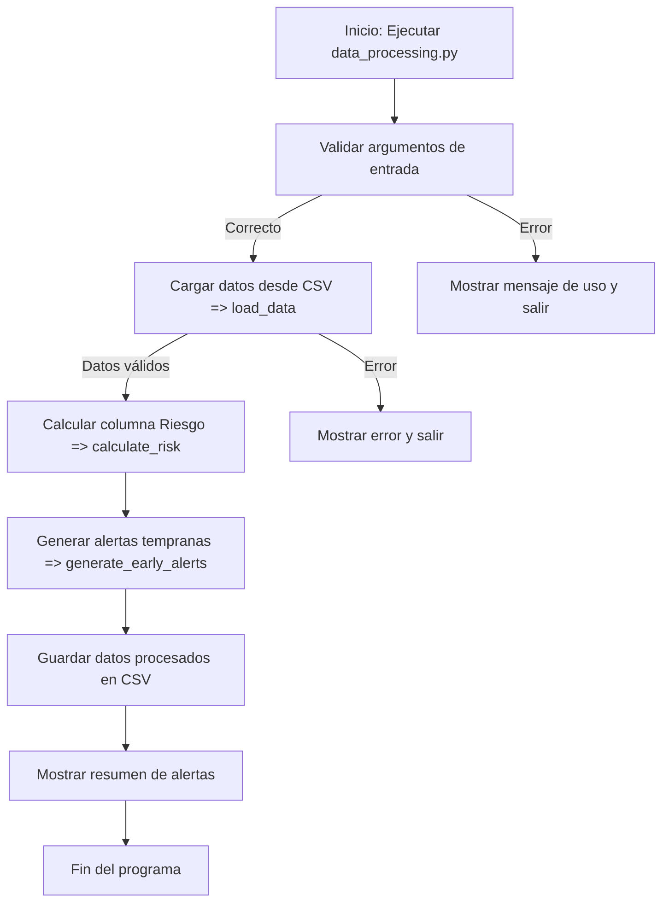

Aquí tienes una explicación de cómo trabaja el archivo data_processing.py junto con un diagrama en formato **Mermaid** para visualizar el flujo del programa:

---

### **Explicación del flujo de trabajo**

1. **Carga de datos (`load_data`)**:
   - El programa comienza cargando un archivo CSV especificado por el usuario.
   - Valida que el archivo contenga las columnas requeridas: `Estado Final`, `Asistencia (%)`, `Participación`, `Tareas Entregadas (10)`, y `Promedio Notas`.
   - Si faltan columnas o hay un error al leer el archivo, se detiene el proceso.

2. **Cálculo del riesgo (`calculate_risk`)**:
   - Agrega una nueva columna llamada `Riesgo` al DataFrame.
   - Clasifica a los estudiantes como en "Riesgo" (`1`) si su `Estado Final` es `Retirado` o `Reprobado`. De lo contrario, se clasifica como `0`.

3. **Generación de alertas tempranas (`generate_early_alerts`)**:
   - Agrega una columna llamada `Alerta_Temprana` basada en reglas específicas:
     - `Asistencia (%) < 60` y `Participación == 'Baja'`.
     - `Tareas Entregadas (10) < 3`.
     - `Promedio Notas < 50`.

4. **Guardado de datos procesados (`process_data`)**:
   - Guarda el DataFrame procesado en un archivo CSV especificado por el usuario.
   - Muestra un resumen de las alertas tempranas generadas.

5. **Ejecución principal (`__main__`)**:
   - El programa se ejecuta desde la línea de comandos con dos argumentos: el archivo de entrada y el archivo de salida.
   - Si no se proporcionan los argumentos correctamente, muestra un mensaje de uso y termina.

---

### **Diagrama en formato Mermaid**



---

### **Detalles clave del flujo**

1. **Validación de argumentos**:
   - El programa verifica que se proporcionen dos argumentos: el archivo de entrada y el archivo de salida.

2. **Carga de datos**:
   - Si el archivo no contiene las columnas requeridas, el programa muestra un mensaje de error y se detiene.

3. **Procesamiento de datos**:
   - Se calculan las columnas `Riesgo` y `Alerta_Temprana` basadas en reglas específicas.

4. **Salida**:
   - Los datos procesados se guardan en un archivo CSV.
   - Se muestra un resumen de las alertas generadas.

---

### **Ejemplo de ejecución**

Si ejecutas el programa con:
```bash
python data_processing.py datos_entrada.csv datos_salida.csv
```

El programa:
1. Carga `datos_entrada.csv`.
2. Calcula las columnas `Riesgo` y `Alerta_Temprana`.
3. Guarda los datos procesados en `datos_salida.csv`.
4. Muestra un resumen como:
   ```plaintext
   Resumen de alertas tempranas:
   0    80
   1    20
   Name: Alerta_Temprana, dtype: int64
   ```

## Criterios de evaluación para generar columnas `Riesgo` y `Alerta_Temprana`

Los criterios para calcular la **alerta temprana** y el **riesgo** en el código parecen estar basados en reglas heurísticas, es decir, reglas definidas manualmente por el programador o el equipo de desarrollo, probablemente basadas en el conocimiento del dominio educativo. Sin embargo, no hay evidencia en el código de que estas reglas tengan un sustento teórico explícito o que hayan sido validadas empíricamente.

### **Análisis de los criterios**

1. **Criterios para la alerta temprana (`Alerta_Temprana`)**:
   - **`Asistencia (%) < 60` y `Participación == 'Baja'`**:
     - Este criterio podría estar basado en la idea de que una baja asistencia combinada con una baja participación indica un desinterés o falta de compromiso del estudiante, lo que podría llevar a un bajo rendimiento.
   - **`Tareas Entregadas (10) < 3`**:
     - Este criterio sugiere que entregar menos de 3 tareas (de un total de 10) es un indicador de riesgo académico.
   - **`Promedio Notas < 50`**:
     - Este criterio podría estar basado en un umbral comúnmente utilizado para identificar un rendimiento académico insuficiente.

   **Sustento teórico**:
   - Estos valores parecen ser arbitrarios o basados en la experiencia del equipo que desarrolló el sistema. Para que tengan un sustento teórico, deberían estar respaldados por investigaciones educativas o análisis estadísticos de datos históricos.

2. **Criterios para el riesgo (`Riesgo`)**:
   - **`Estado Final in ['Retirado', 'Reprobado']`**:
     - Este criterio clasifica a los estudiantes como en "Riesgo" si su estado final es "Retirado" o "Reprobado".
   - Este criterio tiene sentido lógico, ya que estos estados finales son indicadores claros de fracaso académico.

   **Sustento teórico**:
   - Este criterio es más directo y probablemente esté basado en la definición institucional de "riesgo académico". Sin embargo, no hay evidencia en el código de que se haya realizado un análisis estadístico para validar esta clasificación.

---

### **Cómo validar o mejorar estos criterios**

1. **Análisis de datos históricos**:
   - Analizar datos históricos de estudiantes para identificar patrones que conduzcan al riesgo académico.
   - Por ejemplo, determinar si realmente `Asistencia (%) < 60` está correlacionado con el fracaso académico.

2. **Consulta con expertos en educación**:
   - Validar los umbrales (`< 60`, `< 3`, `< 50`) con expertos en el dominio educativo.

3. **Modelos predictivos**:
   - En lugar de reglas heurísticas, se podrían usar modelos de aprendizaje automático para identificar patrones más precisos y basados en datos.

---

### **Ejemplo de entrada y salida**

#### **Entrada (`datos_entrada.csv`)**
```csv
Estado Final,Asistencia (%),Participación,Tareas Entregadas (10),Promedio Notas
Aprobado,85,Alta,8,75
Reprobado,50,Baja,2,45
Retirado,40,Baja,1,30
Aprobado,95,Media,10,90
Aprobado,60,Alta,5,55
```

#### **Salida (`datos_salida.csv`)**
```csv
Estado Final,Asistencia (%),Participación,Tareas Entregadas (10),Promedio Notas,Riesgo,Alerta_Temprana
Aprobado,85,Alta,8,75,0,0
Reprobado,50,Baja,2,45,1,1
Retirado,40,Baja,1,30,1,1
Aprobado,95,Media,10,90,0,0
Aprobado,60,Alta,5,55,0,0
```

#### **Resumen de alertas tempranas (en consola)**
```plaintext
Resumen de alertas tempranas:
0    3
1    2
Name: Alerta_Temprana, dtype: int64
```

---

### **Conclusión**
Los criterios actuales son reglas heurísticas que pueden ser útiles como punto de partida, pero sería ideal validarlos con datos históricos o investigaciones educativas para garantizar su efectividad.