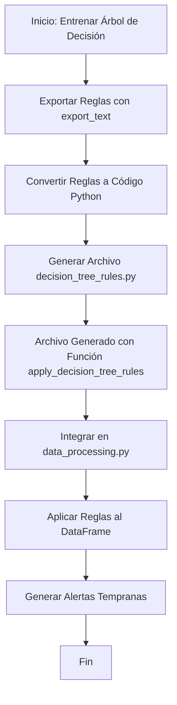

### EXPORTAR REGLAS APRENDIDAS A UN SCRYPT PYTHON

Diagrama en formato **Mermaid** que describe cómo funciona el algoritmo de exportación de reglas desde el árbol de decisión hacia un archivo Python (`decision_tree_rules.py`):

---

### **Explicación del diagrama**

1. **Inicio: Entrenar Árbol de Decisión**:
   - El proceso comienza con el entrenamiento del árbol de decisión utilizando los datos de entrada.

2. **Exportar Reglas con `export_text`**:
   - Se utiliza la función `export_text` de `sklearn` para extraer las reglas aprendidas por el árbol en formato de texto.

3. **Convertir Reglas a Código Python**:
   - Las reglas en formato de texto se procesan para convertirlas en código Python que pueda ser ejecutado.

4. **Generar Archivo `decision_tree_rules.py`**:
   - El código Python generado se guarda en un archivo llamado `decision_tree_rules.py`.

5. **Archivo Generado con Función `apply_decision_tree_rules`**:
   - El archivo contiene una función llamada `apply_decision_tree_rules` que aplica las reglas aprendidas al DataFrame.

6. **Integrar en data_processing.py**:
   - La función `apply_decision_tree_rules` se importa en data_processing.py para ser utilizada.

7. **Aplicar Reglas al DataFrame**:
   - Las reglas se aplican al DataFrame para generar la columna `Alerta_Temprana`.

8. **Generar Alertas Tempranas**:
   - Se generan las alertas tempranas basadas en las reglas aprendidas.

9. **Fin**:
   - El proceso termina con las alertas generadas y listas para ser utilizadas.

---
